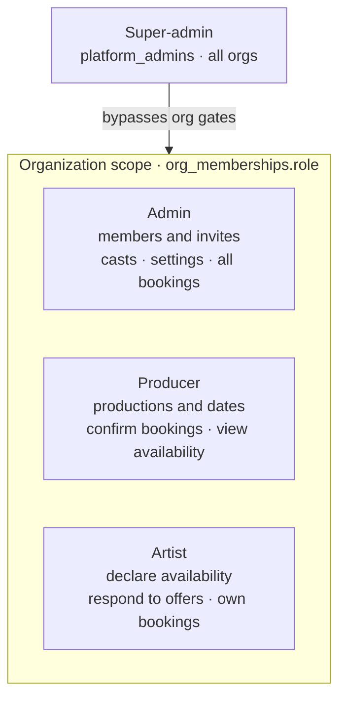

# Showflow Pro — App Logic Guide

This document explains how the platform works: roles, data model, eligibility, and the full booking flow from availability to confirmed cast. It is intended for admins and producers who need to understand the system's behaviour, not just its UI.

---

## Roles and Access

Showflow Pro has **four roles across two scopes**. Three are *organization* roles — values of the `app_role` enum (`admin | producer | artist`) stored per-org in `org_memberships`, so the same person can hold different roles in different orgs. The fourth, **super-admin**, is a *platform* role: membership in the `platform_admins` table (not part of the enum) that bypasses org gates, sees every org, and is the only role that can reach the Platform console.



| Role | Scope | What they can do |
|---|---|---|
| **Super-admin** | Platform (global) | God-mode across every org: provision orgs, manage platform admins, plus everything an org admin can do. Bypasses the org-membership and suspended-org gates. |
| **Admin** | One org | Full org control: invite/remove members, manage casts and eligibility, configure settings, manage all bookings, view all data. |
| **Producer** | One org | Manage productions and show dates, trigger and confirm bookings, view artist availability. No member admin or platform access. |
| **Artist** | One org | Declare availability on eligible dates, respond to offers, view their own bookings. |

### Access by area

| Area | Admin | Producer | Artist | Super-admin |
|---|:--:|:--:|:--:|:--:|
| Dashboard · Chats · Profile | ✅ | ✅ | ✅ | ✅ |
| Shows & Bookings · Productions · Artists | ✅ | ✅ | — | ✅\* |
| Settings | ✅ | ✅ | — | ✅\* |
| Availability | — | — | ✅ | ✅\* |
| Admin (invites & members) | ✅ | — | — | ✅\* |
| Platform console | — | — | — | ✅ |

\* Super-admins satisfy every org-role check in the UI (`effectiveHasRole` short-circuits to `true`); the `✅*` cells are reachable via that god-mode rather than an org membership. Nav and route gating live in `src/components/layout/navItems.ts` and `src/App.tsx`.

### How roles are assigned and enforced

Onboarding is **invite-only** — there is no public signup and no approval queue. An org admin invites a person by email (`create-invitation`); the invitee accepts via the emailed `/accept-invite?token=` link, which writes their `org_memberships` row (role chosen at invite time). The first super-admin is bootstrapped once per environment (see `docs/runbooks/first-super-admin-bootstrap.md`); thereafter super-admins provision orgs and their first admin from the Platform console.

Roles are **always enforced server-side by Postgres RLS**, via the `has_org_role(uuid, org_id, app_role)` / `is_org_member(...)` / `is_super_admin(...)` security-definer functions. The client's `useAuth().hasRole(...)` only shapes the UI (hiding nav, gating pages) and is never trusted for data access.

### Not roles (even though they look like one)

- **View-as** (`viewAsRole` / `viewAsUser`) — editor-mode impersonation that lets an admin or super-admin preview the app as another role or a specific user. UI only; never bypasses RLS.
- **`is_understudy`** — a per-booking flag (auto-promotes when a primary cancels), not a role.
- **`artists.cast_role`** — a reserved, currently-unused column (ADR-0011).

---

## Data Model

### Why these tables are separate

The four core tables — `shows`, `show_dates`, `bookings`, and `availability` — model distinct things with different lifetimes and cardinalities. Merging them would cause duplication and break the independence between an artist's general calendar availability and their bookings for specific productions.

### `shows`

A show is a production template: program name, sub-program, and status. One show row represents the production as a whole, not any specific performance date. Venues are set per show date (not on the show itself); slot capacity lives in the `main_cast_slots` and `understudy_slots` columns on this table (`NULL` = unconfigured, so the date never reaches *fully filled*).

### `show_dates`

Each row is one performance instance of a show: a specific date, city, optional venue override, and session times. One show typically has many dates. Status progresses from `open` → `partially_filled` → `fully_filled`, or `cancelled`.

### `bookings`

The join between an artist and a show date. One booking row = one artist assigned to one performance. Status moves through the lifecycle:

```
suggested → soft_booked → confirmed
             (any state) → cancelled
```

Each booking records who created it (`booked_by`), whether the artist is an understudy (`is_understudy`), and all status changes are appended to `booking_audit_log` (never deleted).

### `availability`

An artist's declared availability on a **calendar date** (not tied to a specific show). One artist can have one availability row per day. Statuses: `available`, `unavailable`, `tentative`.

This separation matters because:
- One artist may be eligible for multiple shows on the same day (e.g. a matinée and an evening). They mark availability once; the booking system handles each show separately.
- Availability can exist before any show date is scheduled.
- Availability and bookings have different access patterns: artists write their own availability; bookings are created by the offer engine.

### `blocked_dates`

An artist's list of dates they are explicitly blocking — dates when they should not receive offers regardless of their general availability status. One row per (artist, date). The `open-offer-tier` function filters out artists with a `blocked_dates` entry before creating offers. Artists manage blocked dates via the calendar UI.

### Identity vs. booking contact

A person can appear in two tables. **`profiles`** is their global login account (one per user:
display name and personal phone — login email lives on `auth.users`, and avatars are deterministic initials, not a stored field). **`artists`** is their bookable talent record *inside an org*
(talent name, booking email/phone, bio, status) — and it exists even for external artists with no
login (`user_id` is empty). These are different real-world contacts, not duplicates, so they are
kept separate (ADR-0011).

When an invited person accepts, their artist row is linked to their login automatically (by email).
For a linked (registered) artist, the offer/confirmation **digest emails go to their login email**
first, falling back to the booking email; the admin can see the effective recipient in the artist's
"Linked account" panel.

---

## Eligibility

Before an artist can receive an offer for a show date, the artist must be **eligible** for that date. Eligibility is defined through casts.

### Casts and cast membership

A cast is a named group of artists (e.g. "London Principal Cast", "NYC Ensemble"). Artists join casts via `cast_members`.

### Show-level eligibility (`show_cast_eligibility`)

A cast can be marked eligible for a given **show + city** combination. This means all members of that cast are eligible for every date of that show in that city.

### Per-date overrides (`show_date_cast_eligibility`)

For finer control, a cast can be made eligible (or restricted) for a single specific show date, overriding the show-level rule.

### Resolution order

`useEligibleArtists` and `useArtistEligibleDates` resolve eligibility as:

1. Collect all casts eligible for the show + city (from `show_cast_eligibility`)
2. Merge with any casts eligible for the specific show date (from `show_date_cast_eligibility`)
3. Union all artist IDs from all collected casts via `cast_members`

If no eligibility config exists at all (no rows in either table for the show date), the system treats eligibility as **unrestricted** (any artist may be booked).

Artists can only declare availability on dates returned by `useArtistEligibleDates` — the calendar makes non-eligible dates non-interactive.

### Cast priorities and the effective ladder

Offer tiers come from an "effective ladder" resolved per (show, city):

1. If the show has `show_cast_eligibility` rows with a `priority` for the date's city,
   those rows ARE the ladder: tier N = the cast with priority N. The org-wide list is
   ignored for that pair.
2. Otherwise the ladder is the org-wide `cast_city_priority` list for the city.

A `show_cast_eligibility` row without a priority keeps its plain meaning: eligible,
untiered (reachable via direct booking or the ad-hoc tier 99). Tier 99 offers the
date's ad-hoc casts minus any cast already in the effective ladder.

Priorities are edited in Settings > Casts & Cities (scope selector: organization
default, or a specific show).

### Required skills

A show can require skills (`show_required_skills`), and a date can add more
(`show_date_required_skills`); the requirement is the union. Requirements are
uniform: an artist qualifies only when holding ALL of them. They are enforced in
the offer engine, the direct-book list, and the artist availability calendar
(an artist missing a required skill does not see the date). Producers can also
scope a single tier open to extra skills ("Only offer to artists with"); that
filter is per-invocation and never applied by automation.

### Offer candidate pipeline

open-offer-tier filters, in order: effective-ladder casts for the tier ->
active artists -> not already booked -> not blocked -> passes the show
eligibility gate (union of show-level and date-level cast rows; none = 
unrestricted) -> holds all required skills. The dry-run preview reports each
exclusion count.

---

## The Offer → Booking Flow

This is the core workflow. Here is the full sequence:

```
New show date arrives via Airtable sync (airtable-poll cron)
        │
        ▼
airtable-poll calls open-offer-tier for Tier 1
        │
        ▼
open-offer-tier edge function:
  1. Resolves the effective ladder for the tier (show_cast_eligibility priority
     rows for this show + city, else the org-wide cast_city_priority list;
     Tier 99 = ad-hoc cast via show_date_cast_eligibility, minus the ladder)
  2. Filters out: inactive artists, artists with existing non-cancelled bookings
     for this date, artists with a blocked_dates entry for this date, artists
     outside the show eligibility gate, artists missing a required skill
  3. Inserts suggested bookings for all remaining candidates
     (no scoring/ranking — all eligible artists in the tier receive an offer)
  4. offer_expires_at is left null until the offer digest is sent
  5. Records the tier as opened in show_date_offer_tiers
        │
        ▼
Daily offer digest email (send-offer-digest, 19:00 Berlin):
  - Sends one consolidated email per artist listing all their pending offers
  - Stamps digest_sent_at = now() and sets offer_expires_at = now() + offer_response_window_hours
  - The expiry clock starts from when the artist is notified, not from offer creation
        │
        ▼
Artist opens their calendar (ArtistAvailabilityCalendar)
  - Dates with pending offers show an "Offer" indicator
  - Clicking the date opens OfferResponseButtons:
      Accept → booking status: suggested → soft_booked
      Decline → booking status: suggested → cancelled (cancellation_reason: 'artist_declined')
        │
        ▼
expire-offers runs hourly:
  - Cancels suggested bookings where offer_expires_at < now() (status → cancelled)
  - If a tier's window has fully closed (no pending, non-expired offers remain)
    and accepted count < required slots, the tier escalates (see Escalation below):
      → auto_escalate on: opens the next tier of the same effective ladder
      → otherwise: creates a cast_escalation_requested in-app notification + emails producers
      → stamps escalation_notified_at (idempotent — fires once per tier)
        │
        ▼
Producer opens /bookings (ShowsBookingsPage)
  - Show date shows "Partially Filled" once soft-booked bookings exist
  - Clicking the date opens ShowDateDetailSheet: review soft-booked artists → confirm or cancel
        │
        ▼
Daily confirmation digest email (send-confirmation-digest, 20:00 Berlin):
  - Sends a confirmation summary to newly confirmed artists
```

### Slot counts and sub-program config

Each **show** carries `main_cast_slots` and `understudy_slots` (one show = one `(program, sub_program)`). If a show's slots are `NULL` (unconfigured) the show date status never reaches `fully_filled` and the UI shows an "Unconfigured" badge — set the counts on the show in **Settings → Scheduling**.

### Offer expiry

Suggested offers that have not been accepted or declined expire once `offer_expires_at` passes. The expiry window (`offer_response_window_hours`, default 48 h) starts from the time the offer digest email is sent — not from when the offer was created. This gives artists the full configured window after they receive notification. The `expire-offers` function runs hourly and cancels any suggested booking whose `offer_expires_at` has passed.

### Escalation

When a tier's window closes short of `main_cast_slots`, `expire-offers` (hourly)
either auto-escalates (booking_flow.auto_escalate: closes the tier and opens the
next tier of the SAME effective ladder that opened it) or, when auto-escalate is
off or the ladder is exhausted, notifies producers to act (`cast_escalation_requested`).
Understudy promotion prefers the accepted understudy whose skills best cover the
cancelled artist's skills, oldest first on ties; skills never block a promotion.

### Understudy promotion

If a confirmed main-cast booking is cancelled (and `booking_flow.understudy_promotion` is on), the system automatically promotes the best available understudy to fill the vacant slot. The promotion trigger selects from `is_understudy = true` bookings on the same show date that are accepted: `soft_booked` in the normal artist-acceptance flow, or `soft_booked`/`confirmed` in direct-booking orgs. Understudies who have blocked the date are skipped.

Among the remaining candidates, the trigger orders by how many of the cancelled artist's skills each understudy shares (most overlap first), then by earliest created booking on ties. Skills only reorder the preference; they never disqualify a candidate.

The winning understudy is promoted to `confirmed`, `is_understudy = false`.

The promotion is recorded in `booking_audit_log` (action: `understudy_promoted`) and the promoted artist receives an `understudy_promoted` in-app notification.

---

## Status Reference

### Booking status

| Status | Meaning |
|---|---|
| `suggested` | Offer has been sent to this artist; no commitment yet |
| `soft_booked` | Artist accepted the offer; producer still needs to confirm |
| `confirmed` | Booking is locked in; artist is on the cast list |
| `cancelled` | Booking cancelled; recorded in audit log, never deleted |

### Show date derived status (producer /bookings view)

| Status | Condition |
|---|---|
| Open | No bookings exist for this date |
| Partially Filled | Some bookings exist but confirmed main cast < required slots |
| Fully Filled | Confirmed main cast ≥ required slots |
| Cancelled | show_date.status = 'cancelled' |
| Unconfigured | The show's `main_cast_slots` / `understudy_slots` are unset (`NULL`) |

### Availability status

| Status | Meaning |
|---|---|
| `available` | Artist has marked themselves free and willing |
| `tentative` | Artist may be available but has a conflict or uncertainty |
| `unavailable` | Artist is not free on this date |
| *(no record)* | Artist has not responded for this date |

---

## Chat

Each show date has a dedicated chat thread (`chats` table, one row per `show_date_id`). Participants are:
- Admins
- Producers
- Artists who are confirmed or soft-booked for that date

Chat threads become **read-only** after `CHAT_ARCHIVE_DAYS` (30 days) past the show date. Admins can still view archived threads. The archive window is configured in `src/config/app.config.ts`.

---

## Notifications

In-app notifications are written to the `notifications` table (`user_id`, `type`, `title`, `message`, `read`, `related_entity_id`, `related_entity_type`). They are created server-side only (edge functions or triggers with appropriate RLS). Read state is a plain boolean `read` field. Notification delivery requires `FEATURES.NOTIFICATIONS = true` (default on).

Transactional email uses the `send-transactional-email` edge function. Templates live in `supabase/functions/_shared/transactional-email-templates/` and are registered in `registry.ts`. New templates must be added to the registry to be deliverable.

---

## Airtable Sync

### Custom (Airtable-synced) fields

Admins can capture extra Airtable fields as typed columns on show dates (Settings → Airtable Sync →
Custom fields). They are stored in `show_dates.custom` (jsonb) and defined per-org in
`custom_field_definitions`. They are **display / filter / sort metadata only** — they never drive
eligibility, offers, slot capacity, or status. If a custom field becomes load-bearing for booking
logic, **promote it to a real typed column** via a migration (add the column, backfill from
`custom`, move the logic onto it) rather than reading `custom` in booking code.

---

## Settings Reference

| Setting | Location | Purpose |
|---|---|---|
| `offer_response_window_hours` | Settings → Booking Engine | Hours after the offer digest email that an artist has to respond before the offer auto-expires (default 48 h) |
| `offer_digest_hour_berlin` | Settings → Booking Engine | Hour (Berlin, 0–23) the daily offer digest is sent (default 19) |
| `confirmation_digest_hour_berlin` | Settings → Booking Engine | Hour (Berlin, 0–23) the daily confirmation digest is sent (default 20) |
| `resend_from_address` | Settings → Booking Engine | Sender address used for transactional email |
| `airtable_sync_enabled` | Settings → Airtable Sync | Enable/disable the per-org Airtable → `show_dates` polling cron |
| `notifications_enabled` | Settings → Notifications | Toggle in-app notifications |
| `filters_visibility` | Settings → Filters | Which filter controls producers and artists see on each page |

Slot capacity is **not** an app setting — it lives in `shows.main_cast_slots` / `shows.understudy_slots`, edited via Settings → Scheduling (Slots per Show) or the Productions page. The `soft_book_expiry_hours`, `sub_program_slots_defaults`, `auto_suggest_enabled`, and `max_suggestions` settings have been retired (no longer read by any code).

Static developer constants (feature flags, route definitions) live in `src/config/app.config.ts` and require a code deploy to change.
