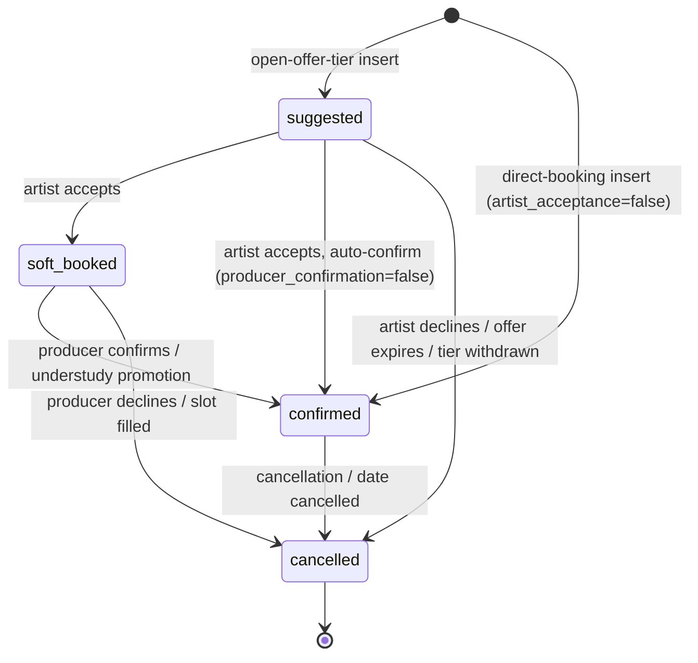
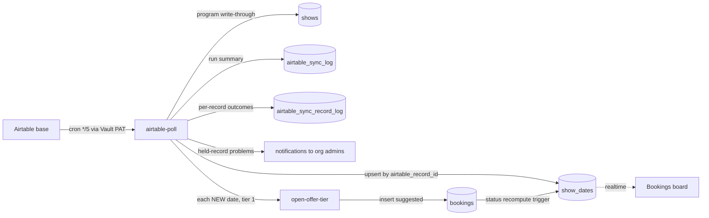
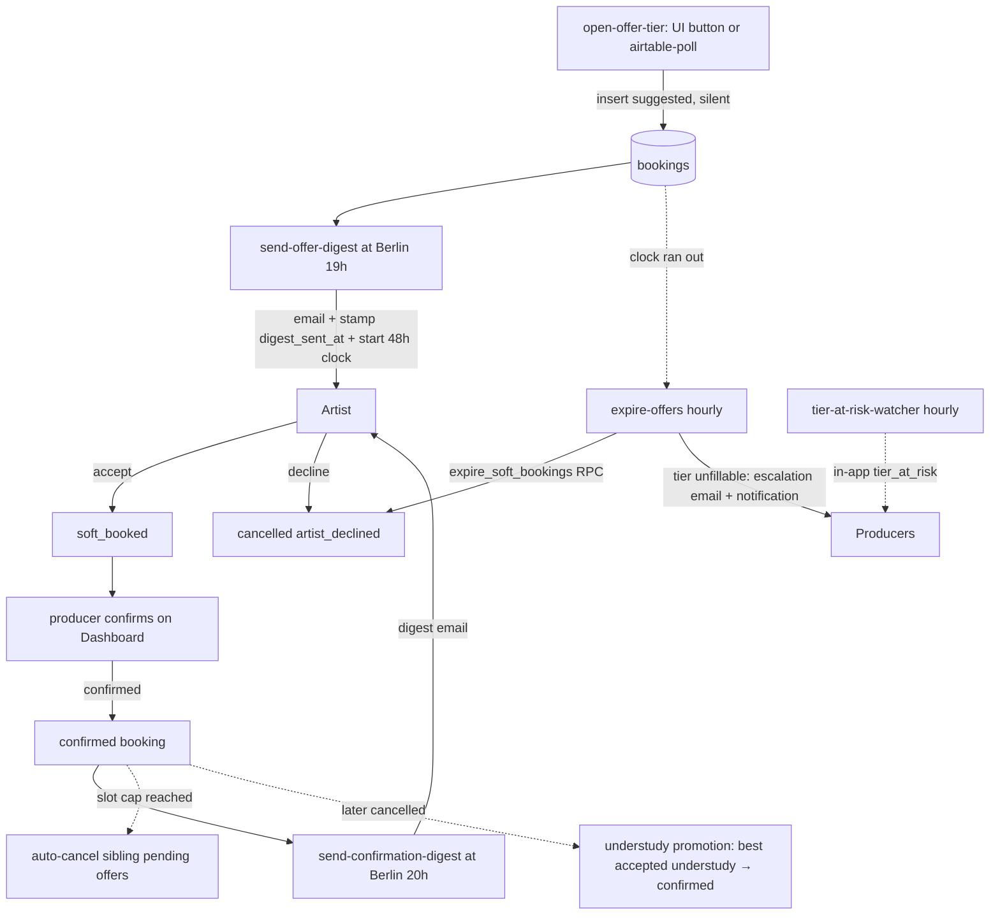

# Showflow Pro — Automation Engine System Map

> **What this is:** the trigger → function → data → side-effect view of the whole automation engine.
> **What this is not:** domain rationale (see `docs/app-logic.md`) or decision history (see `docs/adr/README.md`).
> **Maintenance rule:** any PR that adds or changes a cron job, edge function, DB trigger/RPC/constraint, email, or notification path MUST update this file **and** the in-app graph data `src/data/systemMap.ts` (which powers the Settings → Documentation → System Map canvas) in the same PR. The `systemMap.test.ts` drift guard fails CI when a function/cron label here and there disagree.
> **As of:** 2026-07-14, branch state (not live-project state).

## 1. The engine in one breath

Every 5 minutes, `airtable-poll` copies each org's Airtable base into `show_dates` and, when the org's `booking_flow.auto_open_tier1` and `artist_acceptance` are both on, opens tier-1 offers for any newly imported (or newly-session-ready) date. Opening a tier inserts `suggested` bookings for every eligible, active, unbooked, unblocked artist in that tier's casts, silently by default; no email or notification fires at insert time unless the org uses immediate offer delivery, in which case `open-offer-tier` emails each artist right away instead of waiting for the digest. At the org's configured Berlin evening hour (default 19:00), digest-mode `send-offer-digest` emails each artist their pending offers and **only then** starts the response clock (default 48 h). Artists accept (`soft_booked`, or straight to `confirmed` when the org disables producer review) or decline; every hour, `expire-offers` first reminds artists whose offer expires within 24 h (when the org opts in), then cancels `suggested` offers whose clock ran out and escalates tiers that can no longer fill, either by auto-opening the next tier when the org allows it or by notifying producers to escalate manually; `tier-at-risk-watcher` flags at-risk tiers in-app for orgs that have that alert on. Producers confirm `soft_booked` holds from the dashboard (or book straight to confirmed in direct mode, skipping offers entirely); artists learn of confirmations in the 20:00 digest, when the org keeps that digest on. The database, not the app, enforces the hard rules: one active booking per artist per date, legal status transitions only, org isolation on every row, auto-cancel when slots fill, understudy auto-promotion (policy-gated) when a confirmed primary cancels. Every email routes through one function (`send-transactional-email`) that checks suppression and per-user preferences before calling Resend, and logs every attempt to `email_send_log`; the Resend webhook `handle-email-suppression` then advances that same log row through the full delivery lifecycle (sent → delivered/delayed/bounced/complained) and upserts `suppressed_emails` on a bounce or complaint. And `cron-health-watcher` checks every 15 minutes that all of the above actually ran, alerting super-admins when it didn't — while its twin, `email-health-watcher`, checks every 15 minutes that email itself is still landing, alerting super-admins in-app (never by email) on a degraded/down transition; `email-log-prune` runs nightly to keep `email_send_log` from growing unbounded.

## 2. Clocks — everything that fires on a schedule

Authoritative definitions: `supabase/migrations/20260624101342_cron_dispatch_timeout.sql` (the original six jobs); `email-health-watcher` added by `20260711000837_email_health_watcher_cron.sql` (same dispatch idiom); `email-log-prune` added by `20260710233405_email_log_prune_and_anonymize.sql` (direct SQL call, no dispatch row — see note below).

| job | schedule | plain English | target function | guard | what it does |
|---|---|---|---|---|---|
| `airtable-poll` | `*/5 * * * *` | every 5 minutes; each org is **gated** by its own `airtable_poll_interval_minutes` (org override → platform default → 5-min floor, 60s grace, read from `airtable_sync_log.synced_at`) — the tick fires every 5 min; orgs on a longer interval skip ticks until their interval elapses | `airtable-poll` | `X-Cron-Secret` only (fan-out path) | Upserts `show_dates` from each active org's Airtable base; opens tier 1 for new dates and for updated dates that just gained a session but have no tier-1 row yet, gated on the org's `auto_open_tier1 && artist_acceptance`. A second entry point — org-admin **"Sync now"** (`requireOrgRole(admin)` + `org_id`) — syncs one org immediately, bypassing the interval gate (not the tier-1 gate) |
| `offer-digest` | `0 16-19 * * *` | hourly 16:00–19:00 UTC; function itself gates to each org's Berlin hour (default 19:00) | `send-offer-digest` | cron secret or admin/producer JWT | Emails artists their pending offers; stamps `digest_sent_at` and starts `offer_expires_at`. Skips orgs whose `booking_flow` is direct-booking (`artist_acceptance=false`, no offers exist) or immediate-delivery (`offer_delivery=immediate`, already emailed at open) |
| `confirmation-digest` | `0 17-20 * * *` | hourly 17:00–20:00 UTC; Berlin-hour gate (default 20:00) | `send-confirmation-digest` | cron secret or admin/producer JWT | Emails artists confirmations + schedule changes + cancellations. Skips the whole org when `booking_flow.confirmation_digest=false` |
| `expire-offers-hourly` | `0 * * * *` | every hour | `expire-offers` | cron secret or admin/producer JWT | Reminds artists 24 h before an unanswered offer expires (gated on `expiry_reminder`, idempotent via `reminder_sent_at`); expires overdue `suggested` offers via `expire_soft_bookings()`; escalates unfillable tiers, auto-opening the next tier and notifying `tier_escalated` when `auto_escalate` is on, else notifying producers to escalate manually |
| `tier-at-risk-hourly` | `5 * * * *` | every hour at :05 | `tier-at-risk-watcher` | cron secret or admin/producer JWT | In-app `tier_at_risk` notifications when pending + accepted < required slots; gated per org on `booking_flow.at_risk_alerts`; self-clears on recovery (including for an org that turns the gate off) |
| `cron-health-watcher` | `*/15 * * * *` | every 15 minutes | `cron-health-watcher` | cron secret only (empty-role `requireCronOrRole` — the JWT path can never authorize) | Classifies every job healthy/failing/stale; alerts super-admins on new failures |
| `email-health-watcher` | `*/15 * * * *` | every 15 minutes | `email-health-watcher` | cron secret only (empty-role `requireCronOrRole`) | Snapshots `email_send_log` deliverability over a lookback window, derives operational/degraded/down, and alerts super-admins in-app on a transition into degraded/down; idempotent via `email_health_state.last_state` |
| `email-log-prune` | `30 3 * * *` | daily at 03:30 | — (no edge function; the pg_cron job body calls `public.prune_email_log()` directly, no `net.http_post` dispatch) | service-role SQL function, no HTTP auth | Deletes `email_send_log` rows older than `email_log_retention_days` (platform `app_settings`, default 90) |

**Dispatch plumbing:** each pg_cron tick runs a SQL wrapper — `net.http_post(...)` to `https://<project>.supabase.co/functions/v1/<fn>` followed by an `INSERT INTO cron_health_dispatch (job_name, request_id)` — so every dispatch is attributable when `cron-health-watcher` later joins `cron_health_dispatch` → `net._http_response` (`20260623042017_cron_dispatch_capture.sql`). Every call passes `timeout_milliseconds := 30000`: pg_net's 5000 ms default misclassified healthy 3–10 s cold-start responses as `timed_out`, paging super-admins falsely (`20260624101342_cron_dispatch_timeout.sql:1-6`). The `X-Cron-Secret` header value comes from `private.cron_secret()`, which since `20260702120010_cron_secret_to_vault.sql` reads Supabase Vault (no member-readable table holds it); edge functions verify it via the service-role-only `get_cron_secret()` RPC with a constant-time compare (`_shared/auth.ts:14-24,116-140`). `email-health-watcher` follows this exact idiom (net.http_post + cron_health_dispatch row + 30s timeout), so `cron-health-watcher` monitors it like any other job. `email-log-prune` is the one exception: its cron body calls `public.prune_email_log()` directly in-database — no HTTP dispatch, no `cron_health_dispatch` row — so it is invisible to `cron-health-watcher`'s classification; its liveness can only be checked via `cron.job_run_details` directly (same blind spot noted in §8 for the watcher's own liveness).

## 3. Buttons — everything a user action fires

Grouped by actor. Full call-site citations live with each row; role gates from `src/App.tsx` + component-level checks.

### Artist (self-service)

| gesture | calls | kind | effect |
|---|---|---|---|
| Availability → toggle a blocked date | inline `blocked_dates` insert/delete — `src/components/availability/AvailabilityPicker.tsx:26,40,43` | mutation | DB guard `trg_enforce_blocked_date_no_active_booking` rejects blocking a date with an active booking |
| Offer accept / decline (`OfferResponseButtons`) | `respondToOffer` — `src/data/bookings.ts:204-220` | mutation | `suggested → soft_booked` or `→ cancelled` (reason `artist_declined`); transition-guarded, notifies producers |
| Profile → Export my data | `export_my_data` RPC — `src/data/account.ts:6` | RPC | Self-scoped GDPR JSON bundle |
| Profile → Delete account | `delete-my-account` — `src/data/account.ts:13` | edge fn | Last-admin guard → `anonymize_user` → auth delete |

### Producer / Admin (org)

| gesture | calls | kind | effect |
|---|---|---|---|
| Show-date sheet → Open tier N | `open-offer-tier` — `src/data/bookings.ts:17` | edge fn | Inserts `suggested` bookings for tier candidates; upserts `show_date_offer_tiers` |
| Show-date sheet → Close tier (± withdraw) | `close-offer-tier` — `src/data/bookings.ts:83` | edge fn | Stamps `closed_at`; withdraw cancels remaining `suggested` offers |
| New show date dialog (opt-in) | `open-offer-tier` auto-call — `src/components/shows/ShowDateFormDialog.tsx:125` | edge fn | Tier 1 opens immediately after manual date creation |
| Dashboard → Confirm / Decline selected | `bulkConfirmSoftBooked` / `bulkDeclineSoftBooked` — `src/data/bookings.ts:138-172` | mutation | `soft_booked → confirmed` / `→ cancelled`; can arm slot-fill auto-cancel and understudy promotion |
| Show-date sheet → per-row confirm/cancel | `updateBookingStatusGuarded` — `src/data/bookings.ts:180-197` | mutation | Same trigger chain, precondition-guarded |
| Admin → Invites → Send / Resend | `create-invitation`, `resend-invitation` — `src/data/invitations.ts:37,104` | edge fn | Insert `org_invitations` + `org-invitation` email |
| Artists page / profile sheet / import → Invite artist | `inviteArtistToApp` — `src/data/invitations.ts:50-55` | edge fn | `create-invitation` with `artist_id` stamped, role forced `artist` |
| Artist import wizard → fetch sheet / commit | `fetch-remote-sheet` — `src/data/remoteSheet.ts:13`; `bulk_import_artists` RPC — `src/data/artistImport.ts:23` | edge fn + RPC | SSRF-guarded CSV fetch; capped, deduped batch insert |
| Admin → Members: role toggles / remove | `set_org_member_role`, `remove_org_member` — `src/data/members.ts:29,41` | RPC | Last-admin-guarded membership changes |
| Settings → Airtable Sync (pickers, linking) | `airtable-schema` ×4 modes — `src/data/airtableSchema.ts:17-67` | edge fn | Schema/table/linked-record/program-pair reads via Vault PAT |
| Settings → Airtable Sync: key save/status/delete | `set_org_airtable_key`, `get_org_airtable_key_status`, `delete_org_airtable_key` — `src/data/airtableKey.ts:15-35` | RPC | Vault-backed PAT management (decrypted key never client-readable) |
| Settings → Airtable Sync: merge duplicate cities | `merge_cities` — `src/data/cities.ts:65` | RPC | Repoints 4 FK tables to survivor city, deletes losers |
| Settings → Booking Engine → template Preview | `preview-transactional-email` — `src/pages/SettingsPage.tsx:107` | edge fn | Server-side React Email render, no send |
| Settings → Organization → rename | `rename_org` — `src/data/orgs.ts:70` | RPC | Name only, slug immutable |
| Editor mode → View-as picker | `admin-list-users` — `src/features/editor/EditorToolbar.tsx:30` | edge fn | Org-scoped user list (real-admin gate) |
| Productions / show dialogs: program & slot edits | inline `shows` / `show_dates` writes — `ShowFormDialog`, `ShowDateFormDialog` | mutation | Ripple: status recompute on every child date; cancel cascades to bookings |

### Super-admin (platform)

| gesture | calls | kind | effect |
|---|---|---|---|
| Platform → New organization | `provision-org` — `src/data/platform.ts:93` | edge fn | Atomic `provision_org` RPC + first-admin invite email |
| Platform → org → Export / Delete | `export-org-data` — `src/data/platform.ts:200`; `delete_org` RPC — `:209` | edge fn + RPC | 27-table JSON bundle; hard teardown across the same 27 tables |
| Platform → System Health | `platform-edge-metrics` — `src/data/platform.ts:67`; `get_cron_health` RPC — `:56`; `get_email_health` RPC — `:86` | edge fn + RPC | Analytics-API latency/error metrics; cron dashboard; Email Delivery panel (delivery/bounce/complaint/failure rates, per-template breakdown, recent issues) |
| Platform → Platform Admins tab | `list/add/remove_platform_admin` — `src/data/platform.ts:116-127` | RPC | Roster management, self-demotion + last-admin blocked |
| Platform → org invite popover → Resend | `resend-invitation` — `src/components/platform/OrgInvitePopover.tsx:21` | edge fn | Same invite email, new idempotency key |

### Public (no auth)

| gesture | calls | kind | effect |
|---|---|---|---|
| Email "Unsubscribe" link / page confirm | `handle-email-unsubscribe` — `src/pages/UnsubscribePage.tsx:32,56` | edge fn | Token-credentialed; upserts `suppressed_emails` |
| `/accept-invite?token=` (after sign-in) | `accept_invitation` RPC — `src/data/invitations.ts:93` | RPC | Membership + artist link + invite consumed |
| Resend deliverability webhook (sent/delivered/delayed/bounce/complaint) | `handle-email-suppression` | webhook | HMAC-verified; updates `email_send_log` lifecycle; bounce/complaint additionally upserts `suppressed_emails` |

## 4. The functions — 22 edge functions at a glance

| function | trigger | auth guard | writes | side effects |
|---|---|---|---|---|
| `airtable-poll` | cron 5-min (per-org interval gate) + org-admin "Sync now" | cron secret only (fan-out) ∨ `requireOrgRole(admin)`+`org_id` (single org, gate bypassed) | `shows`, `show_dates`, `airtable_sync_log`, `airtable_sync_record_log`, `notifications` | invokes `open-offer-tier` for new + updated-ready dates, gated on `auto_open_tier1 && artist_acceptance`; Airtable API |
| `open-offer-tier` | UI + `airtable-poll` | service-role ∨ org admin/producer | `bookings` (insert `suggested`), `show_date_offer_tiers`; 409 instead of any write for direct-booking orgs (`artist_acceptance=false`); `dry_run:true` writes nothing and returns a candidate preview | none in digest mode; immediate-delivery orgs (`offer_delivery=immediate`) get an `offer-immediate` email right away, stamped only for sends that succeeded |
| `close-offer-tier` | UI | service-role ∨ org admin/producer | `show_date_offer_tiers`, `bookings` (withdraw) | none |
| `expire-offers` | cron hourly + UI | cron secret ∨ admin/producer | `bookings` (`reminder_sent_at`); `notifications` (`offer_expiring`, `tier_escalated`, `cast_escalation_requested`), `show_date_offer_tiers` (escalation stamp); `expire_soft_bookings()` RPC → `bookings` | `offer-expiry-reminder` email 24 h before expiry (gated `expiry_reminder`); `auto_escalate` on: auto-opens the next tier, no email; else `cast-escalation-requested` email to producers |
| `tier-at-risk-watcher` | cron hourly + UI | cron secret ∨ admin/producer | `notifications` (insert + self-clearing delete); gated per org on `at_risk_alerts` (stale notifications still clear for a gated org) | none — in-app only |
| `send-offer-digest` | cron hourly (Berlin gate) + UI | cron secret ∨ admin/producer | `bookings` (`digest_sent_at`, `offer_expires_at`); skips immediate-delivery and direct-booking orgs | `artist-offer-digest` email |
| `send-confirmation-digest` | cron hourly (Berlin gate) + UI | cron secret ∨ admin/producer | `notifications`, `show_date_change_log` (`digested_at`), `bookings` (`confirmation_digest_sent_at`); skipped entirely when `confirmation_digest=false` | `artist-confirmation-digest` email |
| `send-transactional-email` | fn→fn only | service-role only | `email_unsubscribe_tokens`, `email_send_log` | Resend API (idempotency-keyed) |
| `preview-transactional-email` | UI | `requireRole(admin,producer)` (gateway JWT off — see §Open questions) | none | render only |
| `handle-email-suppression` | Resend webhook | HMAC signature (Standard Webhooks) | `email_send_log` (full lifecycle: sent/delivered/delivery_delayed/bounced/complained, matched by `resend_id`), `suppressed_emails` (bounce/complaint only) | none |
| `handle-email-unsubscribe` | public link | unsubscribe token | `email_unsubscribe_tokens` (atomic use), `suppressed_emails` | none |
| `airtable-schema` | UI | org admin | none | Airtable Meta/Data API |
| `create-invitation` | UI | org admin | `org_invitations` | `org-invitation` email |
| `resend-invitation` | UI | org admin (disclosure-safe 403) | none | `org-invitation` email |
| `admin-list-users` | UI | org admin | none | none |
| `provision-org` | UI | super-admin | `provision_org` RPC → org + catalog + invite | `org-invitation` email |
| `export-org-data` | UI | super-admin | none | none |
| `platform-edge-metrics` | UI | super-admin | none | Supabase Analytics API |
| `delete-my-account` | UI | own JWT | `anonymize_user` RPC; `auth.admin.deleteUser` | none |
| `fetch-remote-sheet` | UI | org producer/admin | none | SSRF-guarded fetch of docs.google.com CSV |
| `cron-health-watcher` | cron 15-min | cron secret only | `cron_health_state`, `cron_health_log`, `notifications`; prunes dispatch/log | `cron-health-alert` email |
| `email-health-watcher` | cron 15-min | cron secret only | `email_health_state` (last_state, last_alerted_at); `notifications` `email_health_degraded` on fresh transition only | none — in-app only by design (email is the thing being monitored) |

### Booking engine — `open-offer-tier`, `close-offer-tier`, `expire-offers`, `tier-at-risk-watcher`

Tier N (1…) = casts ranked at priority N for the date's city (`cast_city_priority`); tier 99 = ad-hoc casts added via `show_date_cast_eligibility` that have no priority entry (prevents double-offering). Candidates = active artists in those casts, minus anyone already actively booked on the date, minus anyone with a `blocked_dates` row. Direct-booking orgs (`booking_flow.artist_acceptance=false`) get a 409 instead of an open: offers are disabled entirely, and producers book straight to `confirmed`. A `dry_run:true` body returns the candidate list plus exclusion counts (`already_booked`/`blocked`/`inactive`) without writing anything. All offers are primary (`is_understudy: false`) — understudy slots never get automated offers, and `understudy_slots` is excluded from the fill math (`_shared/tierFill.ts:34-46`). `offer_expires_at` is not written by the insert itself: digest-mode orgs wait for `send-offer-digest` to stamp it when the daily email actually sends, while immediate-delivery orgs (`offer_delivery=immediate`) email each offer right away and stamp `digest_sent_at`/`offer_expires_at` moments later in the same call, only for the offers whose `offer-immediate` email delivered. `expire-offers` also runs a 24 h-before-expiry reminder pass ahead of escalation (`offer-expiry-reminder` email + `offer_expiring` in-app, `reminder_sent_at` idempotency, gated on `expiry_reminder`). Escalation fires once per tier (`escalation_notified_at` stamp) when zero pending non-expired offers remain and accepted < required: with `auto_escalate` on, it closes the short tier and opens the next `cast_city_priority` tier automatically (`tier_escalated` notification, no email); otherwise, or if that auto-open invoke fails, it falls back to notifying producers to escalate manually (`cast-escalation-requested`). At-risk flagging (`tier-at-risk-watcher`) is the earlier, softer signal (pending + accepted < required), gated per org on `at_risk_alerts`, and self-heals by deleting its notifications when a tier recovers, closes, or the org turns the gate off. Cites: `open-offer-tier/index.ts:59-217,271-376`, `close-offer-tier/index.ts:61-90`, `expire-offers/index.ts:23-361`, `tier-at-risk-watcher/index.ts:29-177`.

### Digests & email — `send-offer-digest`, `send-confirmation-digest`, `send-transactional-email`, `preview-transactional-email`, `handle-email-suppression`, `handle-email-unsubscribe`, `email-health-watcher`

Both digests iterate `getActiveOrgs`, resolve the org's Berlin send-hour via `resolveOrgSetting`, and no-op unless the current Berlin hour matches — the cron fires hourly across a window so summer/winter time both hit. Each digest additionally gates on the org's `booking_flow`: `send-offer-digest` skips direct-booking (`artist_acceptance=false`) and immediate-delivery (`offer_delivery=immediate`) orgs, and `send-confirmation-digest` skips any org with `confirmation_digest=false`. Recipient resolution is login-email-first via `resolve_user_contacts` (ADR-0011). Stamps are written **only after** `emailWasSent()` confirms Resend accepted — a failed send self-retries next hour because the query keys on the missing stamp. All sends funnel through `send-transactional-email` (service-role callers only), which short-circuits on `suppressed_emails` (fail-closed), checks `should_notify` category×channel prefs (fail-open), mints unsubscribe tokens, logs every attempt to `email_send_log` as a single-row state machine (`pending → sent/failed/suppressed/pref_disabled`), and passes the caller's idempotency key to Resend so retried digest runs can't double-send. Cites: `send-offer-digest/index.ts:21-51,62-140`, `send-confirmation-digest/index.ts:55-255`, `send-transactional-email/index.ts:34-269`.

**Deliverability lifecycle:** the Resend webhook `handle-email-suppression` advances that same `email_send_log` row (matched by `resend_id`) through every subsequent delivery event — `sent → delivered` (or `delivery_delayed`, `bounced`, `complained`) — stamping the matching `*_at` column each time; `email.opened`/`email.clicked` events are acknowledged and ignored. `bounced`/`complained` events additionally upsert `suppressed_emails`, which is what makes the fail-closed suppression check in `send-transactional-email` accurate. If the webhook event arrives before the send row exists (or the row was pruned), it inserts a synthetic fallback row so deliverability counts stay correct rather than silently under-counting. **Health monitoring:** `email-health-watcher` (cron `*/15 * * * *`, mirroring `cron-health-watcher`'s dispatch idiom exactly) calls the `email_health_snapshot(p_window_minutes)` RPC to aggregate delivery/bounce/complaint/failure rates over a lookback window, runs them through the shared `deriveEmailStatus` thresholds (Deno mirror of the frontend's), and — gated on a minimum volume floor so a handful of events can't false-alarm — alerts all super-admins in-app (`email_health_degraded` notification, **no email**: the channel being monitored can't be trusted to carry its own outage alert) only on a transition into degraded/down, tracked idempotently via `email_health_state.last_state`. It aborts (no state write, no alert) rather than guess on any snapshot- or state-read failure, so an outage is never silently recorded as healthy. **Retention:** the separate `email-log-prune` cron (daily `30 3 * * *`) calls `public.prune_email_log()` directly — no edge function — deleting `email_send_log` rows older than the platform `email_log_retention_days` setting (default 90); `anonymize_user` (GDPR erasure) additionally scrubs `email_send_log.recipient_email` to `[anonymized]` for a deleted user's address so old log rows don't retain PII past account deletion. Cites: `handle-email-suppression/index.ts`, `email-health-watcher/index.ts:21-90`, `_shared/emailHealth.ts`, `20260710233405_email_log_prune_and_anonymize.sql`.

### Airtable sync — `airtable-poll`, `airtable-schema`

`airtable-poll` is org-fault-isolated (one org's failure never aborts the others) and idempotent per record via `airtable_record_id`. It resolves linked venue/city records, maps custom fields (`custom_field_definitions`), write-throughs program changes to `shows`, handles cancel/revival status flips, logs every run (`airtable_sync_log`) and every record outcome (`airtable_sync_record_log`), and notifies org admins (`airtable_sync_held`) only on new/worsening held-record problems. New dates, and updated dates that just gained a session but have no tier-1 row yet, go to `open-offer-tier` tier 1, batched 10 at a time, gated on the org's `booking_flow.auto_open_tier1 && artist_acceptance` (a direct-booking org has no offer step, and `open-offer-tier` now 409s in that mode, so the gate also avoids pointless failing invokes). The cron tick fires every 5 minutes for every active org, but each org is gated by its own `airtable_poll_interval_minutes` (org override → platform default → 5-min floor, with a 60s grace window) — the gate reads the org's most recent `airtable_sync_log.synced_at` and skips the org until the interval has elapsed, so a poll actually only runs on the ticks the org's cadence calls for. A second, scoped entry point on the same function powers an org-admin **"Sync now"** button (Settings → Airtable Sync): `requireOrgRole(admin)` + a single `org_id` in the body syncs that one org immediately, bypassing the interval gate entirely. `airtable-schema` is the read-only mapping helper behind Settings → Airtable Sync; a PAT lacking schema scope degrades to `{schemaAccessible:false}` rather than erroring. Cites: `airtable-poll/index.ts:103-523`, `airtable-schema/index.ts:22-185`.

### Org & platform — `provision-org`, `create-invitation`, `resend-invitation`, `admin-list-users`, `platform-edge-metrics`, `cron-health-watcher`

Invitation flow: insert `org_invitations` (token via DB default) → best-effort `org-invitation` email (failure never orphans the invite — admins can copy the link). `provision-org` delegates atomicity to the `provision_org` RPC called through the **caller's JWT** so the RPC's own super-admin check holds. `platform-edge-metrics` talks to the Supabase Management/Analytics API (dedicated `ANALYTICS` PAT — project keys can't reach it); it queries `function_edge_logs` by `function_id` and resolves ids to slugs via the functions-list API. Cites: `create-invitation/index.ts:33-86`, `provision-org/index.ts:18-57`, `platform-edge-metrics/index.ts:76-111`.

### GDPR & import — `delete-my-account`, `export-org-data`, `fetch-remote-sheet`

`delete-my-account` orders its writes fail-safe: last-admin check (`sole_admin_orgs`, caller-JWT so `auth.uid()` scoping holds) → `anonymize_user` (caller-JWT) → `auth.admin.deleteUser` (service role). The one risky window: anonymize succeeded but auth-delete failed (no rollback). `export-org-data` reads 27 org tables, aborts on any single failure (never a partial bundle). `fetch-remote-sheet` allows exactly `docs.google.com` published-CSV URLs — manual redirects, 8 s timeout, 5 MB cap. Cites: `delete-my-account/index.ts:8-30`, `export-org-data/index.ts:8-46`, `fetch-remote-sheet/index.ts:7-75`.

## 5. The gates — database-enforced rules

What the database can refuse (or do on its own), regardless of which code path writes. This is the layer that makes application bugs survivable.

### Triggers

| trigger | table | fires on | enforces / derives | rejects? | latest definition |
|---|---|---|---|---|---|
| `trg_derive_org_id` (`derive_org_id_for_booking`) | `bookings` | BEFORE INSERT/UPDATE of `artist_id`,`show_date_id` | derives `org_id` from show_date; artist must be same org | **yes** — cross-org pairing | `20260616162454_bookings_artist_org_guard.sql` |
| `enforce_booking_transition_trigger` | `bookings` | BEFORE UPDATE of `status` | booking state machine (below) | **yes** — illegal transition | `20260702120020_booking_transition_guard.sql`; `suggested → confirmed` added by `20260714104826_booking_flow_guard_and_reminder.sql` |
| `promote_understudy_on_cancellation` | `bookings` | AFTER UPDATE: confirmed primary → cancelled | promotes best **accepted** (`soft_booked`) understudy to `confirmed`, or a **confirmed** understudy too when the org is direct-booking (`artist_acceptance=false`, so there is no `soft_booked` hold to promote from); skipped entirely when `understudy_promotion=false`; skips understudies who blocked the date; audit-logs + notifies | no | binding `20260519000000…`; body `20260714105906_understudy_promotion_flow_gates.sql` |
| `log_app_settings_change` | `app_settings` | AFTER INSERT OR UPDATE | inserts a `settings_audit_log` row (org_id, key, actor, old/new value); no-ops on an UPDATE that didn't actually change the value; feeds the Settings → Booking flow "Change history" rail | no | `20260714103537_settings_audit_log.sql` |
| `slot_fill_auto_cancel_trigger` | `bookings` | AFTER UPDATE | when a confirm fills the slot cap, auto-cancels sibling `suggested`/`soft_booked` of that slot type | no | body `20260616203749_auto_cancel_reads_shows_slots.sql` |
| `sync_show_date_status_trigger` | `bookings` | AFTER INSERT/UPDATE/DELETE | recomputes `show_dates.status` (ADR-0006) | no | body `20260616172104_slots_on_shows.sql` |
| `sync_show_dates_on_show_update_trigger` | `shows` | AFTER UPDATE of program/sub_program/slots | recomputes status of every child date | no | `20260616172104_slots_on_shows.sql` |
| `cascade_cancel_bookings_on_date_cancel` | `show_dates` | AFTER INSERT/UPDATE, `NEW.status='cancelled'` | cancels all active bookings on the date (`date_cancelled`); suppresses understudy promotion during the cascade via GUC | no | `20260620130000_show_date_cancellation.sql` |
| `log_show_date_schedule_change` | `show_dates` | AFTER UPDATE of sessions/status | appends `show_date_change_log` rows consumed by the confirmation digest | no | `20260620140000_schedule_change_notifications.sql` |
| `trg_enforce_blocked_date_no_active_booking` | `blocked_dates` | BEFORE INSERT/UPDATE | artist can't block a date holding an active booking | **yes** — booking conflict | `20260702120030_blocked_dates_eligibility_guard.sql` |
| `notify_booking_transition_trigger` | `bookings` | AFTER UPDATE | audit log + notifications: `suggested→soft_booked` → producers; `soft_booked→confirmed` → artist | no | body `20260604133000_org_scope_assignments_and_autocancel.sql` |
| `trg_derive_org_id` (`derive_org_id_from_sync_log_id`) | `airtable_sync_record_log` | BEFORE INSERT | copies `org_id` from parent sync-log row | no | `20260617164248_airtable_sync_records.sql` |
| `on_auth_user_created` (`handle_new_user`) | `auth.users` | AFTER INSERT | creates `profiles` row (profile-only since approval flow retired) | no | body `20260603140000_retire_approval_flow.sql` |
| `update_updated_at_column()` (10 live tables) | various | BEFORE UPDATE | bumps `updated_at` | no | fn `20260416115633…`; latest binding `20260623045101…` |

### The booking state machine

Enforced by `enforce_booking_transition()` — identical rule for **every** writer (artist client, producer client, every SECURITY DEFINER function; no role carve-outs). Illegal transitions raise `check_violation`. Pinned by pgTAP `supabase/tests/triggers/enforce_booking_transition.sql` (13 assertions).

`cancelled` is terminal, the guard exists precisely because a stale producer UI once "resurrected" a cancelled booking to confirmed (migration header, `20260702120020`). Backwards moves stay impossible. `suggested → confirmed` used to be one of them: `20260714104826_booking_flow_guard_and_reminder.sql` added it to the trigger's legal set so an artist's acceptance can auto-confirm in a single step for an org that disables producer review. The trigger allows that jump unconditionally, but an artist's own client can only actually land there because the "Artists can respond to own offers" RLS `WITH CHECK` (`20260714111652_artist_self_confirm_policy.sql`) separately re-checks the show_date's own org `booking_flow.producer_confirmation` at write time (via `get_org_setting`, resolved from the booking's `show_date_id`, not the row's own client-writable `org_id`, so a tampered `org_id` can't borrow another org's setting); with producer confirmation still on, that same UPDATE is rejected by RLS before the trigger even runs, so `soft_booked` stays the only state an artist's own acceptance can reach. Direct-booking orgs (`artist_acceptance=false`) reach `confirmed` a third way that bypasses the state machine altogether: `enforce_booking_transition_trigger` fires `BEFORE UPDATE OF status` only, so `createBooking`'s INSERT with `status='confirmed'` is never subject to it, any initial status is legal on insert.

`show_dates.status` is a second, fully derived machine (ADR-0006): `open | partially_filled | fully_filled | cancelled`, recomputed by `compute_show_date_status()` from confirmed counts vs `shows.main_cast_slots`/`understudy_slots`. `cancelled` is never overwritten by the recompute; NULL capacity ⇒ can never reach `fully_filled`. Client code must never write this column.

### Constraints & indexes that encode business rules

| name | table | rule | migration |
|---|---|---|---|
| `bookings_active_artist_date_uniq` | `bookings` | at most ONE non-cancelled booking per (show_date, artist); cancelled history rows unlimited | `20260616161112_bookings_active_unique.sql` |
| RESTRICTIVE `org_isolation` policy (pattern) | all tenant tables (~20+) | `is_org_member(auth.uid(), org_id)` ANDed onto every permissive policy, USING + WITH CHECK (blocks org_id smuggling); super-admin passes via `is_super_admin` short-circuit | `20260603120200_org_isolation_rls.sql` (ADR-0003) |
| `notifications_null_org_id_platform_only` | `notifications` | only `cron_health_alert` may have NULL `org_id` (else invisible under RLS) | `20260623123155…` |
| `show_date_offer_tiers` UNIQUE (show_date_id, tier) | `show_date_offer_tiers` | one row per tier per date | `20260514180000…` |
| `blocked_dates` UNIQUE (artist_id, date) | `blocked_dates` | one block per artist per date | `20260514190000…` |
| `shows` / `cities` airtable key UNIQUE per org (partial) | `shows`, `cities` | catalog-link keys unique per org (ADR-0010) | `20260617110532…` |
| `app_settings` UNIQUE NULLS NOT DISTINCT (org_id, key) | `app_settings` | one platform-default + one per-org override per key | `20260604120000…` |
| `org_invitations.token` UNIQUE | `org_invitations` | token is the credential; note: no DB dedup on (org_id, email) — see Open questions | `20260603120000…` |

### Guarded RPCs (the callable automation)

| rpc | guard | one line | writes |
|---|---|---|---|
| `accept_invitation` | invite email must match caller's auth email | membership + artist link (id-stamp first, email fallback) + invite consumed | `org_memberships`, `artists`, `org_invitations` — `20260701185118…` |
| `expire_soft_bookings` | **service-role only** (hardened `20260703100321` after the audit found it callable by authenticated AND anon) — clients go through the `expire-offers` edge fn | cancels only `suggested` past `offer_expires_at`; accepted holds never auto-expire | `bookings` — `20260702120002…` |
| `set_org_member_role` / `remove_org_member` | org admin; last-admin blocked (table-locked) | role/membership management | `org_memberships` — `20260622164142…` / `20260604160000…` |
| `bulk_import_artists` | org producer/admin | capped 5000, per-row dedup on lower(email), per-row status array | `artists` — `20260701214715…` |
| `anonymize_user` | self ∨ super-admin (must call via own JWT) | GDPR scrub: deletes user-scoped rows, nulls artist PII, keeps audit skeleton, scrubs `email_send_log.recipient_email` to `[anonymized]` | 10 tables — `20260622193223…`, extended `20260710233405…` |
| `delete_org` | super-admin | hard teardown across 27 tables (export-org-data mirrors the same list) | everything org-scoped — `20260622193255…` |
| `provision_org` | super-admin | atomic org + catalog seed + first-admin invite | `organizations`, `org_invitations`, catalog — `20260604140000…` |
| `sole_admin_orgs` / `export_my_data` | self-scoped via `auth.uid()` | deletion guard / GDPR export | read-only — `20260622205426…` |
| `get_cron_secret` / `get_org_airtable_key` / `resolve_user_contacts` / `get_user_id_by_email` / `cron_health_scan` / `email_health_snapshot` / `prune_email_log` | **service-role only** | secrets + cross-schema reads + the raw email-deliverability aggregation + the retention delete, none of which the client may run directly | `prune_email_log` deletes from `email_send_log`; the rest read-only — `20260710232631…`, `20260710233405…` |
| `get_email_health` | authenticated, super-admin-gated in-body (`is_super_admin` check, not GRANT-level) | wraps `email_health_snapshot` behind the god-mode check for the System Health panel | read-only — `20260710232631…` |
| `merge_cities` | org admin of survivor | repoints 4 FK tables, deletes losers | 5 tables — `20260617193521…` |
| `should_notify` | **service-role only** (hardened `20260703100321`; the `gate_notification_pref` trigger calls it as definer/owner) | category×channel opt-out; missing row ⇒ true | read-only — `20260622181552…` |

## 6. The two big flows, end to end

### 6.1 A show date's life — Airtable → bookable date

Airtable is the system of record for show dates (ADR-0001) — in-app date creation exists but synced dates are owned by the poll. Cancelled Airtable records flip the date to `cancelled`, which cascades: `cascade_cancel_bookings_on_date_cancel` cancels every active booking, the schedule-change trigger queues digest rows, and understudy promotion is suppressed during the cascade. Held records (unmappable rows) don't block the run; admins get one `airtable_sync_held` notification per new/worsening problem, and the Sync Status tab reads the per-record log.

### 6.2 An offer's life — tier opened → confirmed booking

Timing subtleties worth holding onto: the response window starts at **digest send**, not offer creation — an offer created at 20:05 waits for tomorrow's 19:00 digest before its 48 h begin. Expiry only ever touches `suggested` rows — an accepted hold (`soft_booked`) waits indefinitely for the producer. And confirmation emails are batched into the 20:00 digest; the only instant artist-facing signal of a confirmation is the in-app notification from `notify_booking_transition`.

## 7. Messages out — every email and notification

| trigger moment | channel | recipient | sender | opt-out path |
|---|---|---|---|---|
| Daily offers pending (Berlin 19:00), digest-mode orgs only | email `artist-offer-digest` | artists with unstamped `suggested` offers | `send-offer-digest` | suppression list, `booking_offers`×email pref, unsubscribe link |
| Offer opened, immediate-delivery orgs only (`offer_delivery=immediate`) | email `offer-immediate` | each artist freshly offered in that tier | `open-offer-tier` | suppression, `booking_offers`×email pref, unsubscribe link |
| Offer expiring within 24 h, unanswered | email `offer-expiry-reminder` + in-app `offer_expiring` | artists with a live, unreminded `suggested` offer | `expire-offers` | gated on `booking_flow.expiry_reminder`; suppression + `booking_offers`×email pref; once per offer (`reminder_sent_at`) |
| Daily confirmations + schedule changes (Berlin 20:00) | email `artist-confirmation-digest` | artists with unstamped confirmations / change-log rows | `send-confirmation-digest` | same; entire digest skipped when `confirmation_digest=false` |
| Schedule change / booking cancelled | in-app `schedule_change` | affected registered artists | `send-confirmation-digest` | notification prefs (in-app channel) |
| Offer accepted (`suggested→soft_booked` or, under auto-confirm, `suggested→confirmed`) | in-app | assigned producers (fallback: org admins) | DB trigger `notify_booking_transition` | notification prefs |
| Booking confirmed (`soft_booked→confirmed`) | in-app | the artist | DB trigger `notify_booking_transition` | notification prefs |
| Tier escalated automatically (`auto_escalate` on, next tier opened) | in-app `tier_escalated` | assigned producers (fallback: org admins) | `expire-offers` | no email; falls back to the manual row below if the auto-open invoke fails |
| Tier can no longer fill, no auto-escalation (hard signal) | email `cast-escalation-requested` + in-app `cast_escalation_requested` | assigned producers (fallback: org admins) | `expire-offers` | suppression + prefs; once per tier (stamp) |
| Tier at risk (soft signal) | in-app `tier_at_risk` | assigned producers (fallback: org admins) | `tier-at-risk-watcher` | gated on `booking_flow.at_risk_alerts`; self-clears on recovery; no email by design |
| Airtable rows held | in-app `airtable_sync_held` | org admins | `airtable-poll` | only on new/worsening problems |
| Org invitation (create / resend / provision) | email `org-invitation` | invitee | `create-invitation`, `resend-invitation`, `provision-org` | n/a (transactional, idempotency-keyed) |
| Cron job failing/stale | email `cron-health-alert` + in-app `cron_health_alert` | all super-admins | `cron-health-watcher` | alert only on transition into failure; recovery is in-app-only |
| Email deliverability degraded/down | in-app `email_health_degraded` | all super-admins | `email-health-watcher` | alert only on transition into degraded/down; no email (the channel being monitored); recovery is in-app-only |
| Any email, any sender | — | — | all routed via `send-transactional-email` | fail-closed on `suppressed_emails`; `should_notify` category×channel; List-Unsubscribe headers |

Inbound: Resend delivery lifecycle (sent/delivered/delivery_delayed/bounced/complained) → `handle-email-suppression` (HMAC-verified) → `email_send_log`; bounces/complaints additionally → `suppressed_emails`; unsubscribe links → `handle-email-unsubscribe` (atomic token consumption) → `suppressed_emails`.

## 8. Observability — who watches the watchers

Every cron dispatch is recorded (`cron_health_dispatch` + pg_net's `net._http_response`); `cron-health-watcher` joins them every 15 min via `cron_health_scan()`, classifies per-job against max-silence windows (`airtable-poll` 30 min, hourly jobs 130 min, digests 1320 min), and alerts super-admins only on the transition into `failing`/`stale` — recovery is in-app-only to avoid flap storms. The System Health tab (super-admin) reads `get_cron_health()` for the cron dashboard, `platform-edge-metrics` for per-function invocation/error/latency stats from the Supabase Analytics API, and `get_email_health()` for the Email Delivery panel (delivery/bounce/complaint/failure rates, per-template breakdown, recent-issues list). Every email attempt — sent, failed, suppressed, pref-blocked — lands in `email_send_log`, and the Resend webhook advances the same row through the full post-send lifecycle (sent → delivered/delayed/bounced/complained), so the snapshot behind the panel reflects what actually happened to a message, not just whether `send-transactional-email` accepted it. `email-health-watcher` is the alerting twin of `cron-health-watcher` for that data — same 15-min cadence and dispatch idiom, but its own blind spot: rows older than `email_log_retention_days` (pruned daily by `email-log-prune`, default 90 days) fall out of every window the snapshot can compute over, and `email-log-prune` itself runs outside the `net.http_post`/`cron_health_dispatch` idiom (direct SQL call), so `cron-health-watcher` cannot see whether the prune ran either — check `cron.job_run_details` for both blind spots. Known blind spot on the crons themselves: neither watcher can observe its own liveness (its own dispatch row is always in-flight when it runs). Cites: `cron-health-watcher/index.ts:21-163`, `email-health-watcher/index.ts:21-90`, `20260623042017_cron_dispatch_capture.sql`, `20260710233405_email_log_prune_and_anonymize.sql`.

## Open questions

1. **`org_invitations` has no DB-level dedup on (org_id, email)** for pending invites — only the token is unique; duplicates are prevented in app logic alone. Unconfirmed whether intentional. (`20260603120000_add_platform_tables_and_org_helpers.sql`)
2. **`preview-transactional-email` is `verify_jwt = false`** in `supabase/config.toml` yet its handler calls `requireRole(["admin","producer"])` — functionally still auth-gated (the guard 401s without a valid JWT); the "public" grouping may be intentional for error messaging or may be config drift.
3. ~~**`should_notify` is probeable cross-user**~~ **FIXED** (`20260703100321_harden_rpc_grants_service_role_only.sql`): EXECUTE revoked from `public`/`anon`/`authenticated`, granted to `service_role` only. Callers unaffected: `send-transactional-email` uses the service-role client; the `gate_notification_pref` trigger is SECURITY DEFINER and executes as owner. Grant posture pinned by pgTAP (`supabase/tests/rpc/should_notify.sql`).
4. **CLAUDE.md function inventory drift** *(fixed in the PR that introduced this map)*: `close-offer-tier`, `platform-edge-metrics`, and `cron-health-watcher` were client-wired but missing from CLAUDE.md's edge-function category list; the count was 21 (not the long-repeated 20) at that time — now 22 with `email-health-watcher` added.
5. ~~**`expire_soft_bookings()` is callable by any authenticated user**~~ **FIXED** (`20260703100321_harden_rpc_grants_service_role_only.sql`): it was in fact callable by `anon` too (the default-privileges grant had never been revoked). EXECUTE now revoked from `public`/`anon`/`authenticated`, granted to `service_role` only — the `expire-offers` edge fn (service-role client, `expire-offers/index.ts:30`) is the sole entry point. Grant posture pinned by pgTAP (`supabase/tests/rpc/expire_soft_bookings.sql`).
6. ~~**`notifications_null_org_id_platform_only` may reject `email-health-watcher`'s own alert.**~~ **FIXED** (`20260711005552_notifications_allow_email_health_alert.sql`): the check constraint (`20260623123155_notifications_platform_org_check_exact.sql`) only allowed a NULL `org_id` for `type IN ('cron_health_alert')`, so `email-health-watcher` inserting `{org_id: null, type: 'email_health_degraded'}` (`email-health-watcher/index.ts:106`) would have read as a constraint violation on every attempt. The follow-up migration adds `email_health_degraded` to the allowed list; the `lives_ok` case in `supabase/tests/db/notifications_platform_null_org.sql` pins it.

---

## Appendix A — full per-function dossiers

The drill-down layer. Sections 1–8 are the altitude; this is the detail, per function, in alphabetical order. All paths relative to `supabase/functions/` unless noted.

### admin-list-users
- **Trigger:** user action (Editor mode "view as" picker — `src/features/editor/EditorToolbar.tsx:30`)
- **Auth:** `requireOrgRole(org_id, ["admin"])` (`index.ts:27`); `verify_jwt = true`
- **Inputs:** `?org_id` query or body `org_id`
- **Reads:** `auth.admin.listUsers()` (≤1000), `org_memberships` filtered to org
- **Writes / side effects:** none
- **Failure:** whole-handler try/catch → 500

### airtable-poll
- **Trigger:** cron `airtable-poll` (5-min fan-out, per-org interval gate) + Settings → Airtable Sync "Sync now" (single org, manual)
- **Auth:** two paths — `requireCronSecret` for the cron fan-out (`index.ts:543`), or `requireOrgRole(org_id, ["admin"])` for a request without the cron secret, scoping "Sync now" to the caller's own org (`index.ts:519-537`); `verify_jwt = false`
- **Gate:** the fan-out path resolves `airtable_poll_interval_minutes` per org (org override → platform default → `MIN_POLL_INTERVAL_MINUTES=5` floor via `resolveOrgSetting`, `index.ts:563-564`) and skips the org unless at least that many minutes (minus a 60s `POLL_GRACE_MS` grace window) have elapsed since its last `airtable_sync_log.synced_at` (`fetchLastPollAt`, `index.ts:24-31`); the "Sync now" path calls the same `syncOneOrg` helper directly and bypasses the gate entirely (`index.ts:478,533`)
- **Reads:** `getActiveOrgs`; per-org settings `airtable_sync_enabled`, `airtable_base_id`, `airtable_table_name`, `airtable_field_map`, `airtable_view`, `airtable_poll_interval_minutes`; Vault PAT via `get_org_airtable_key`; `shows`, `cities`, `custom_field_definitions`, existing `show_dates`, previous sync logs; Airtable Data + Meta APIs
- **Writes:** `shows` (re-key + program write-through, `index.ts:294-317`), `show_dates` insert/update (`index.ts:337-376`), `airtable_sync_log` (`index.ts:413-425`), `airtable_sync_record_log` (`index.ts:430-437`), `notifications` `airtable_sync_held` (`index.ts:150-158`)
- **Tier-1 auto-open gate:** gated on `auto_open_tier1 && artist_acceptance` (a direct-booking org has no offer step, and `open-offer-tier` would just 409); candidates are this run's new dates plus UPDATED dates that just gained a session but have no tier-1 row yet, over-inclusion is safe since `open-offer-tier` no-ops benignly for a not-yet-ready date (`index.ts:408-431`)
- **Side effects:** invokes `open-offer-tier` for new + updated-ready dates, batched 10, only when the tier-1 auto-open gate above passes (`index.ts:124-141`)
- **Failure:** per-org isolation (`index.ts:520-523`); Airtable API error → 502 after logging; misconfig → error log row + continue; MAX_PAGES=100 truncation warning; idempotent by `airtable_record_id`; "Sync now" without `org_id` → 400

### airtable-schema
- **Trigger:** user action (Settings → Airtable Sync)
- **Auth:** `requireOrgRole(orgId, ["admin"])` (`index.ts:53`); `verify_jwt = true`
- **Inputs:** `org_id` + optional `baseId` / `linkedTableId` / `tableName`+`programField`(+`subProgramField`) — four modes
- **Reads:** Vault PAT via `get_org_airtable_key`; Airtable Meta/Data APIs. **Writes:** none
- **Failure:** Airtable 403 → `{schemaAccessible:false}` 200 (expected fallback); 401 → 400; other → 502; base-list page cap logged (record-page caps in modes C/D are silent)

### close-offer-tier
- **Trigger:** user action (show-date sheet)
- **Auth:** service-role bypass, else `requireRole` + `requireOrgRole(sd.org_id, ["admin","producer"])` (`index.ts:23-52`); `verify_jwt = true`
- **Inputs:** `show_date_id`, `tier`, `withdraw?`
- **Writes:** `show_date_offer_tiers.closed_at` (`index.ts:61-67`); withdraw: cancel remaining `suggested` of that tier, reason `tier_closed` (`index.ts:80-90`) — soft_booked/confirmed untouched
- **Failure:** withdraw-write error leaves tier closed (documented safe order); idempotent re-close

### create-invitation
- **Trigger:** user action (Admin → Invites; artist-invite surfaces)
- **Auth:** `requireOrgRole(body.org_id, ["admin"])` (`index.ts:33`); `verify_jwt = true`
- **Inputs:** `org_id`, `email`, `role`, `app_origin`, `artist_id?` (validated same-org + unclaimed, forces role artist)
- **Writes:** `org_invitations` (`index.ts:59-66`)
- **Side effects:** `org-invitation` email via `deliverOrgInvitation`, idempotency `org-invitation-{invite.id}`; best-effort
- **Failure:** delivery failure swallowed — invite row survives, link copyable

### cron-health-watcher
- **Trigger:** cron `cron-health-watcher` (15-min)
- **Auth:** `requireCronOrRole(req, [])` — empty role list, so only a valid `X-Cron-Secret` can ever authorize (`index.ts:63`); `verify_jwt = false`
- **Reads:** `cron_health_scan()` RPC (dispatch ⋈ `net._http_response`); `KNOWN_JOBS` max-silence map (`index.ts:31-38`)
- **Writes:** `cron_health_state` upsert; `cron_health_log` on transitions; `notifications` `cron_health_alert`; prunes dispatch >1 d, log >30 d (`index.ts:122-163`)
- **Side effects:** `cron-health-alert` email to each super-admin on failure transition; in-app only on recovery
- **Failure:** scan/state errors abort early (no false-healthy, no alert storm); idempotent via transition detection (`!wasFailing`); cannot observe own liveness (`index.ts:21-25`)

### delete-my-account
- **Trigger:** user action (Profile → Danger Zone)
- **Auth:** own JWT via `userClient(authHeader).auth.getUser()` (`index.ts:8-13`); `verify_jwt = true`
- **Order:** `sole_admin_orgs` (caller JWT) → 409 `last_admin` if sole admin → `anonymize_user` (caller JWT) → `auth.admin.deleteUser` (service role)
- **Failure:** each step fails closed; risky window = anonymize ok + delete failed (no rollback)

### email-health-watcher
- **Trigger:** cron `email-health-watcher` (15-min)
- **Auth:** `requireCronOrRole(req, [])` — empty role list, so only a valid `X-Cron-Secret` can ever authorize (`index.ts:17`); `verify_jwt = false`
- **Reads:** `email_health_snapshot(p_window_minutes)` RPC over `email_send_log` (default 1440-min window for the RPC, `EMAIL_ALERT.windowMinutes` for the watcher's own call); `email_health_state.last_state`
- **Writes:** `email_health_state` upsert (`last_state`, `last_alerted_at`); `notifications` `email_health_degraded` — one row per super-admin, only on a fresh transition into degraded/down
- **Side effects:** none — in-app only by design; unlike `cron-health-watcher` there is deliberately no email backstop (email is the thing being monitored)
- **Volume guard:** below `EMAIL_ALERT.minVolumeForAlert` sent emails, a derived degraded/down state is suppressed back to operational unless raw failure count alone clears `EMAIL_ALERT.failureAlertCount` — protects against a 2-of-3 sample looking like a bounce storm
- **Failure:** snapshot-read or state-read error aborts early (503, no write) rather than risk recording a false-healthy state or an alert storm; if the alert insert itself fails on a fresh transition, `last_state` is deliberately NOT advanced so the next run re-detects the same transition and retries — the single notification channel must not silently drop the only alert

### expire-offers
- **Trigger:** cron `expire-offers-hourly` + manual admin/producer
- **Auth:** `requireCronOrRole(["admin","producer"])` (`index.ts:29`); `verify_jwt = false`
- **Reminder pass (runs before escalation):** for each active org with `expiry_reminder` and `artist_acceptance` both on, emails every `suggested` booking whose `offer_expires_at` falls within the next 24 h and hasn't been reminded yet (`offer-expiry-reminder` template); stamps `bookings.reminder_sent_at` only when the email actually sent, and inserts an `offer_expiring` in-app notification for registered artists (`index.ts:38-175`)
- **Reads:** open never-escalated tiers; show/slot config; date bookings; `resolve_show_assignments` for recipients (fallback org admins)
- **Writes:** `bookings.reminder_sent_at`; `expire_soft_bookings()` RPC (cancels overdue `suggested` only); `notifications` `offer_expiring` / `tier_escalated` / `cast_escalation_requested`; `escalation_notified_at` stamp
- **Auto-escalation:** when the tier's org has `auto_escalate` on and a higher-priority `cast_city_priority` tier exists for the date's city, closes the short tier, invokes `open-offer-tier` for that next tier, and notifies `tier_escalated` instead of asking a human; a failed invoke does not count as an auto-escalation and falls through to the manual path below so a producer still gets notified (`index.ts:260-317`)
- **Manual escalation fallback:** no next tier, `auto_escalate` off, or the auto-open invoke failed: `cast_escalation_requested` notification + `cast-escalation-requested` email per recipient, best-effort (`index.ts:319-346`)
- **Escalation rule:** future date ∧ configured slots ∧ zero pending non-expired in tier ∧ accepted < required (`index.ts:203-231`; helpers `tierFill.ts:43-67`)

### export-org-data
- **Trigger:** user action (Platform → Edit org → Export)
- **Auth:** `requireSuperAdmin` (`index.ts:23`); `verify_jwt = true`
- **Reads:** 27 org-scoped tables (`index.ts:8-17`); excludes user-scoped `notification_preferences`
- **Failure:** any table error → 500, no partial bundle

### fetch-remote-sheet
- **Trigger:** user action (artist import wizard)
- **Auth:** `requireOrgRole(org_id, ["producer","admin"])` (`index.ts:36`); `verify_jwt = true`
- **Guards:** exact host `docs.google.com`, `/spreadsheets/` path, `format=csv`; no redirects; 8 s abort; 5 MB double-checked (`index.ts:7-64`)

### handle-email-suppression
- **Trigger:** Resend webhook (full deliverability lifecycle: sent, delivered, delivery_delayed, bounced, complained; also opened/clicked, which are acknowledged and ignored)
- **Auth:** Standard-Webhooks HMAC, constant-time, 300 s staleness window (`index.ts:7-48,96`); `verify_jwt = false`
- **Writes:** `email_send_log` — updates the row matched by `resend_id` with the new `status` and the corresponding `*_at` stamp (`sent_at`/`delivered_at`/`delayed_at`/`bounced_at`/`complained_at`); inserts a synthetic fallback row if no matching row exists yet (event raced the send, or the row was pruned). `bounced`/`complained` additionally upsert `suppressed_emails` (reason bounce|complaint)
- **Failure:** bad signature → 401; non-lifecycle events acknowledged `{ignored:true}`; idempotent upsert/update; a failed `email_send_log` write is logged but does not fail the suppression write (or vice versa) — the two are independent best-effort steps

### handle-email-unsubscribe
- **Trigger:** public unsubscribe link (GET validate, POST consume; RFC 8058 one-click)
- **Auth:** the token is the credential; `verify_jwt = false`
- **Writes:** `email_unsubscribe_tokens.used_at` atomically (`.is('used_at', null)`, `index.ts:85-91`); `suppressed_emails` upsert reason `unsubscribe`
- **Failure:** used token → safe no-op; raw token never logged

### open-offer-tier
- **Trigger:** user action (show-date sheet, new-date dialog) + fn→fn from `airtable-poll`
- **Auth:** service-role bypass, else `requireRole` + `requireOrgRole(showDate.org_id, ["admin","producer"])` (`index.ts:18-21,63-66`); `verify_jwt = true`
- **Gate:** direct-booking orgs (`booking_flow.artist_acceptance=false`) get a 409 right after the org-scoped auth check, before any pipeline work; offers stay disabled entirely for that org (`index.ts:68-76`)
- **Inputs:** `show_date_id`, `tier`, optional `dry_run:true`, which returns the candidate list and exclusion counts (`already_booked`/`blocked`/`inactive`) without writing anything (`index.ts:25-30,205-216`)
- **Tier resolution:** tier 99 = ad-hoc eligibility minus prioritized casts; tier N = `cast_city_priority` at rank N; candidates filtered by active status, existing active booking, `blocked_dates`
- **Writes:** `bookings` batch insert `status='suggested', is_understudy=false, offer_tier` (`index.ts:229-246`); `show_date_offer_tiers` upsert re-opens tier, resets escalation (`index.ts:252-263`)
- **Immediate delivery:** when `booking_flow.offer_delivery='immediate'`, emails each freshly-offered artist right away (`offer-immediate` template) and stamps `digest_sent_at`/`offer_expires_at` only on the bookings whose email actually sent, in this same request; digest-mode orgs leave both columns null for `send-offer-digest` to stamp later (`index.ts:271-376`)
- **Side effects:** none in digest mode (silent until the daily digest); `offer-immediate` email in immediate mode
- **Failure:** cancelled date → 400; direct mode → 409; no sessions → 200 benign skip (protects airtable-poll batches); tier-upsert failure after insert → 200 + `tier_tracking_warning`; a failed immediate-delivery send leaves the offer unstamped for the digest to retry; dedup relies on pre-filter + `bookings_active_artist_date_uniq`

### platform-edge-metrics
- **Trigger:** user action (Platform → System Health)
- **Auth:** `requireSuperAdmin` (`index.ts:59`); `verify_jwt = true`
- **Reads:** Supabase Analytics API `logs.all` with fixed SQL over `function_edge_logs` — invocations, 5xx, p50/p95 per function (`index.ts:19-54`); needs `ANALYTICS` PAT
- **Failure:** unconfigured → 500 `metrics_unconfigured`; upstream errors → 502; malformed payload degrades to empty metrics

### preview-transactional-email
- **Trigger:** user action (Settings → template preview)
- **Auth:** `requireRole(["admin","producer"])` in-handler (`index.ts:14`); `verify_jwt = false` at gateway (see Open questions §2)
- **Behavior:** renders one or all registry templates with `overrides`; per-template `render_failed` / `preview_data_required` statuses, always 200

### provision-org
- **Trigger:** user action (Platform → New organization)
- **Auth:** `requireSuperAdmin` (`index.ts:18`); `verify_jwt = true`
- **Writes:** `provision_org` RPC via caller's JWT (atomic org + catalog seed + invite) (`index.ts:33-34`)
- **Side effects:** `org-invitation` email, idempotency `org-invitation-{org_id}`, best-effort
- **Failure:** 23505 → 409 slug taken; email failure never rolls back the org

### resend-invitation
- **Trigger:** user action (Invites tab, artist sheet, platform popover)
- **Auth:** `requireOrgRole(invite.org_id, ["admin"])` after disclosure-safe 403 existence check (`index.ts:22-24`); `verify_jwt = true`
- **Side effects:** `org-invitation` email, idempotency `org-invitation-resend-{invite.id}`
- **Failure:** non-pending invite → 409

### send-confirmation-digest
- **Trigger:** cron `confirmation-digest` (Berlin-hour gated, default 20:00) + manual
- **Auth:** `requireCronOrRole(["admin","producer"])` (`index.ts:25`); `verify_jwt = false`
- **Gate:** skips the whole org when `booking_flow.confirmation_digest=false`; NOT gated on `artist_acceptance`, direct-booking orgs still rely on this digest as their only booking notification (`index.ts:59-60`)
- **Reads:** per-org `confirmation_digest_hour_berlin`; unstamped confirmed bookings; undigested `show_date_change_log`; `resolve_user_contacts`
- **Writes:** `notifications` `schedule_change` (`index.ts:222`); `change_log.digested_at` only when in-app insert succeeded (`index.ts:236-241`); `bookings.confirmation_digest_sent_at` only when `emailWasSent` (`index.ts:273-278`)
- **Side effects:** `artist-confirmation-digest` email, idempotency `confirmation-digest-{org}-{artist}-{hour}`
- **Failure:** per-org and per-artist isolation; failed sends self-retry next hour via missing stamps

### send-offer-digest
- **Trigger:** cron `offer-digest` (Berlin-hour gated, default 19:00) + manual
- **Auth:** `requireCronOrRole(["admin","producer"])` (`index.ts:19`); `verify_jwt = false`
- **Gate:** skips any org whose `booking_flow` is direct-booking (`artist_acceptance=false`, no offers exist to digest) or immediate-delivery (`offer_delivery='immediate'`, already emailed at open by `open-offer-tier`) (`index.ts:56-57`)
- **Reads:** per-org `offer_digest_hour_berlin`, `offer_response_window_hours` (default 48); unstamped non-expired `suggested` bookings; `resolve_user_contacts`
- **Writes:** `bookings.digest_sent_at` + `offer_expires_at = now()+window`, the only place the expiry clock starts for digest-mode orgs (`index.ts:161-164`), only when `emailWasSent`
- **Side effects:** `artist-offer-digest` email, idempotency `offer-digest-{org}-{artist}-{hour}`
- **Failure:** unstamped offers stay pending and retry; artist still sees offers in-app meanwhile

### send-transactional-email
- **Trigger:** fn→fn only (digests, invitations, escalation, cron alerts)
- **Auth:** `isServiceRole` (`index.ts:34-36`); `verify_jwt = true` (service-role key is itself a valid JWT)
- **Pipeline:** suppression check (fail-closed, `index.ts:80-89`) → `get_user_id_by_email` + `should_notify` pref gate (fail-open, `index.ts:107-128`) → unsubscribe-token mint (`index.ts:152-157`) → org overrides via `resolveOrgSetting` (`email_template_overrides`, `resend_from_address`) → React Email render → Resend API with caller's `Idempotency-Key` + List-Unsubscribe headers (`index.ts:214-244`)
- **Writes:** `email_send_log` at every stage: suppressed / pending / sent / failed
- **Failure:** suppressed/pref-blocked → 200 `{success:false, reason}` (callers distinguish via `emailWasSent`); Resend error → 500 + failed log row

### tier-at-risk-watcher
- **Trigger:** cron `tier-at-risk-hourly` + manual
- **Auth:** `requireCronOrRole(["admin","producer"])` (`index.ts:35`); `verify_jwt = false`
- **Gate:** skipped per (show_date's) org when `at_risk_alerts` is off or the org is direct-booking (`artist_acceptance=false`, no offer tiers to be at risk); a gated tier is simply never re-added to the still-at-risk set, so any stale notification for it clears on the very next run, same as a tier that recovered (`index.ts:92`)
- **Rule:** open tier ∧ future date ∧ configured slots ∧ pending + accepted < required (`index.ts:98-123`, shared `tierFill.ts`)
- **Writes:** `notifications` `tier_at_risk` deduped per (tier, user); deletes stale rows when tier recovers, closes, or its org turns the gate off (`index.ts:160-172`)
- **Side effects:** none — in-app only by design (`index.ts:18-19`)

*Shared infrastructure:* `_shared/auth.ts` (all `require*` guards + constant-time compares), `_shared/settings.ts` (`resolveOrgSetting`, `getActiveOrgs`, `BOOKING_ENGINE_DEFAULTS`), `_shared/deps.ts` (DI: admin client, userClient, env, now, invokeFunction, sendEmail, fetch; `emailWasSent`), `_shared/http.ts` (CORS + json + preflight). Every function is `handle(req, deps)` with `Deno.serve((req) => handle(req, realDeps()))` at the bottom (ADR-0002).
